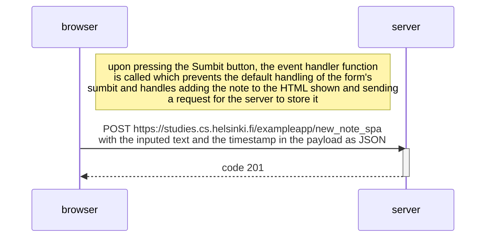

```mermaid
sequenceDiagram
    participant browser
    participant server

    Note right of browser: upon pressing the Sumbit button, the event handler function <br> is called which prevents the default handling of the form's <br> sumbit and handles adding the note to the HTML shown and sending <br> a request for the server to store it

    browser->>server: POST https://studies.cs.helsinki.fi/exampleapp/new_note_spa <br> with the inputed text and the timestamp in the payload as JSON
    activate server
    server-->>browser: code 201
    deactivate server
    
```